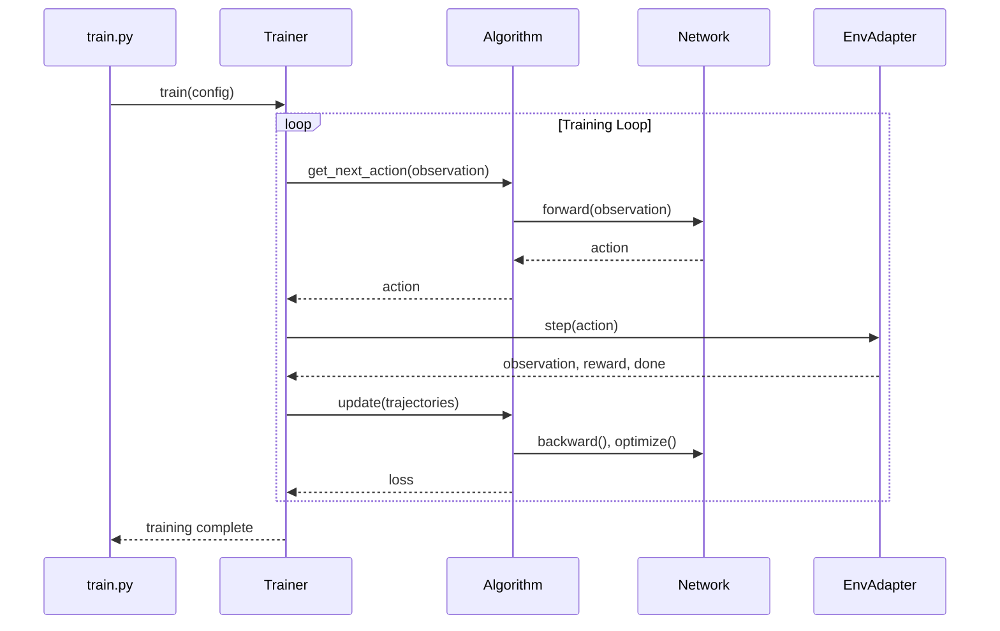

# rl_v2

A lightweight, extensible reinforcement‑learning training framework with three independent plugin systems for
algorithms, network architectures, and environment backends. This repository contains the core library in
`rl_v2/` along with example entry points (`train.py`, `infer.py`).

---

## Quick start

Install requirements and dependencies (PyTorch, TorchRL, Gymnasium, etc.)

```bash
python -m venv .venv            # create virtualenv if you haven't already
source .venv/bin/activate

# install the core package; the `gpu` extra is a convenience name only –
# you still need to pull a CUDA‑enabled wheel from the official PyTorch
# index (replace `cu121` / `cpu` etc. according to your CUDA version):
#
#   pip install "torch>=2.0+cu121" -f https://download.pytorch.org/whl/torch_stable.html
#   pip install rl_v2[gpu]
#
# or, if you prefer the latest CPU‑only build:
#   pip install torch
#   pip install -e .

pip install -e .                # install this package in editable mode
pip install torchrl tensordict gymnasium[classic-control] tensorboard moviepy pygame
# if you want Box2D environments you also need system SWIG and the
# corresponding gymnasium extra:
#   sudo apt-get install swig   # or brew install swig, etc.
#   pip install "gymnasium[box2d]"
```

Train a model using the provided CLI utility:

```bash
# MLP + PPO on CartPole
python train.py --algo ppo --net mlp --env CartPole-v1

# SAC (off‑policy) with continuous Pendulum
python train.py --algo sac --net mlp --env Pendulum-v1

# CNN policy on Atari (requires `pip install ale-py`)
pip install ale-py
python train.py --algo ppo --net cnn --env ALE/Pong-v5

# Box2D examples (CartPole or LunarLander) require gymnasium[box2d]
# and a SWIG installation (see quick start above). Once installed you
# can train with --env LunarLander-v2, etc.
```

Additional options such as backend (`--backend gymnasium|isaac|omniverse`), device
(defaults to `cuda` if available), learning rate, run directory, checkpoint
frequency, and video recording can be passed via the command line. See
`python train.py --help` for a full list.

## Training Sequence Diagram

The diagram below illustrates the main interaction loop during training:



The training loop coordinates between the environment adapter, neural network policy, and learning algorithm to collect rollouts and update model parameters iteratively.

## Adding a custom environment backend

The framework routes all environment interaction through an ``EnvAdapter``
subclass. To plug in your own simulator:

1. **Implement an adapter** that inherits from
   ``rl_v2.envs.base.BaseEnvAdapter``. At minimum, override
   ``setup()``, ``reset()``, ``step()``, and optionally ``get_observation()`` /
   ``get_action()`` for preprocessing/postprocessing.
2. **Register your adapter** before invoking ``train.py``:

```python
from rl_v2.envs import register_adapter

# built‑in path: use a relative module string beginning with a dot
register_adapter("my_sim", ".my_sim_adapter:MyAdapter")

# external package example
register_adapter("my_sim", "my_pkg.envs:MyAdapter")
```

3. Launch training with ``--backend my_sim`` (or configure ``EnvConfig``
   directly).

The internal registry lookup is performed by ``rl_v2.envs.factory.make_env_adapter``,
which will raise a helpful error if the name is unknown or the module fails to
import.

For additional developer guidance see ``rl_v2/README.md`` inside the package.

## Further reading

The core library provides detailed documentation in ``rl_v2/README.md``; refer
there for architecture diagrams, how to register new networks and algorithms,
and the dataflow between components.

---

